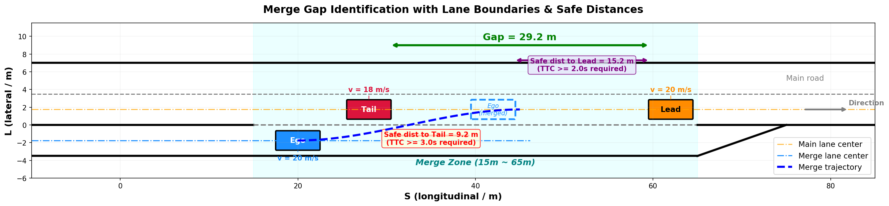
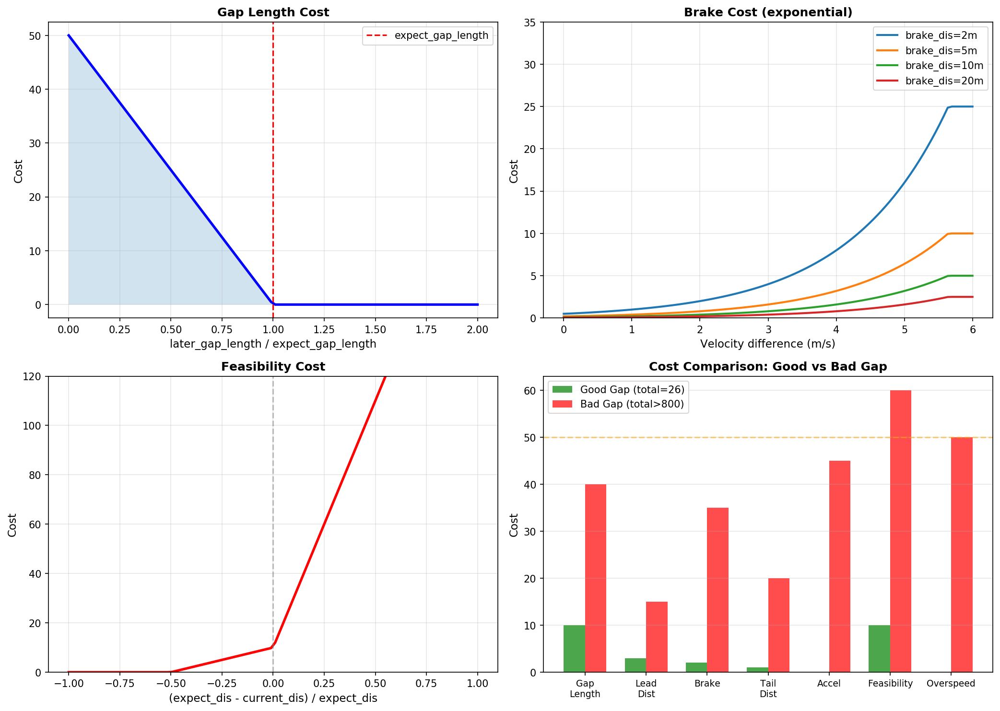
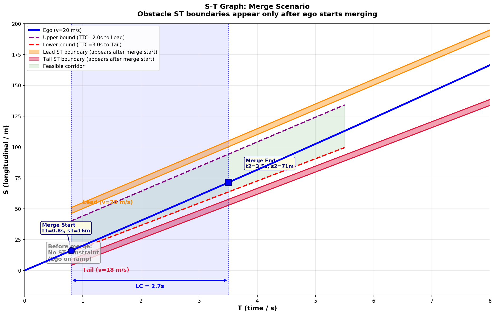

# 汇入场景决策评估体系

## 1. 概述
### 1.1 问题背景
汇入场景（如匝道汇入主路、辅路汇入主路）是典型的强博弈场景：自车需要在有限的空间和时间窗口内，找到目标车道上的安全间隙（Gap），完成横向切入。与常规跟车或超车不同，汇入场景的核心挑战在于：

+ **时空约束强**：汇入区域有限（实线、护栏等物理边界），必须在规定距离内完成
+ **多智能体博弈**：目标车道车辆可能加速/减速，Gap 动态变化
+ **安全要求高**：需要同时保证与前车（Gap Lead）和后车（Gap Tail）的安全距离

### 1.2 方案定位
本方案设计独立的汇入决策评估体系，核心思路：

1. **Gap 识别与生成**：基于预测线与道路拓扑，识别目标车道上的所有可通行 Gap
2. **约束构建与剪枝**：为每个 Gap 独立构建 TTC/THW 约束，对不可行轨迹进行剪枝
3. **加权评分排序**：以后车所需减速度为核心安全指标，结合体感代价、通行效率等辅助指标，完成 Gap 优先级排序
4. **iLQR 轨迹优化**：将最优 Gap 的约束条件输出给 iLQR 优化器，生成最终轨迹

## 2. 系统架构
### 2.1 模块总览
```plain
┌─────────────────────────────────────────────────────────────────┐
│                     GapDecider（总入口）                          │
│  make_gap_decision()                                            │
└────────────┬────────────────────────────────────────────────────┘
             │
     ┌───────┴────────┐
     │                │
┌────▼─────┐    ┌─────▼──────────────┐
│ DenseFlow │    │ Analytic Gap       │
│ GapDecider│    │ Decider            │
└────┬──────┘    └─────┬──────────────┘
     └───────┬─────────┘
             │
     ┌───────▼───────────────────┐
     │ GapGenerator              │
     │ 扫描障碍物，生成候选 Gap   │
     └───────┬───────────────────┘
             │
     ┌───────▼───────────────────┐
     │ GapScoreByRule            │
     │ 加权评分，排序 Gap 优先级  │
     └───────┬───────────────────┘
             │
     ┌───────▼───────────────────┐
     │ GapMergeZoneSolver        │
     │ 计算汇入区域边界 (s1,t1)→(s2,t2) │
     └───────┬───────────────────┘
             │
     ┌───────▼───────────────────┐
     │ MergeZoneRule             │
     │ 生成 iLQR 硬/软约束       │
     └───────┬───────────────────┘
             │
     ┌───────▼───────────────────┐
     │ IlqrSpeedTrajectoryOptimizer │
     │ 轨迹优化输出              │
     └───────────────────────────┘
```

### 2.2 执行流程
```cpp
// GapDecider::Update() 主流程
bool GapDecider::make_gap_decision(TaskInfo& task_info, ...) {
  // 1. 生成候选 Gap
  GapGenerator generator(...);
  auto& candidate_gaps = generator.generate_candidate_gap();

  // 2. 对每个 Gap 评分
  GapScoreByRule scorer;
  for (auto& gap : candidate_gaps) {
    gap.cost = scorer.get_score(gap);
  }

  // 3. 选择最优 Gap（cost 最低）
  auto best_gap = select_best_gap(candidate_gaps);

  // 4. 计算汇入区域
  GapMergeZoneSolver solver;
  solver.get_merge_point_for_sample_cur(...);  // 计算 (s1, t1)
  solver.calc_end_s_for_gap(...);              // 计算 (s2, t2)

  // 5. 输出约束给 iLQR
  MergeZoneRule rule;
  rule.calc_ilqr_decision_bound_info(...);
}
```
## 3. Gap 识别与生成
### 3.1 核心数据结构
```cpp
struct ModelGap {
  enum class ModelGapType {
    FORWARD = 0,   // 前方 Gap（加速汇入）
    ORIGINAL = 1,  // 平行 Gap（当前位置汇入）
    BACKWARD = 2,  // 后方 Gap（减速汇入）
  };

  ModelGapType gap_type;
  const ObstacleFeature* gap_lead;       // Gap 前车
  const ObstacleFeature* gap_tail;       // Gap 后车
  double gap_lead_reverse_ratio;         // 前车预测修正系数
  double gap_tail_reverse_ratio;         // 后车预测修正系数
  const ObstacleFeature* cruise_lead_obs; // 本车道前车
  const ObstacleFeature* cruise_tail_obs; // 本车道后车
  const EgoFeature* ego_feature;         // 自车状态
};
```

### 3.2 Gap 生成逻辑
`GapGenerator::generate_candidate_gap()` 扫描目标车道上的所有障碍物，按纵向位置排序后，相邻两个障碍物之间形成一个候选 Gap：



```cpp
const std::vector<ModelGap>& GapGenerator::generate_candidate_gap() {
  // 1. 获取目标车道障碍物（按 relative_s 排序）
  std::set<const ObstacleFeature*, ReleativeSCompare> target_lane_obs;

  // 2. 过滤不相关障碍物
  for (auto& obs : all_obstacles) {
    if (should_ignore_obstacle_by_type(obs)) continue;
    if (!is_on_target_lane(obs)) continue;
    target_lane_obs.insert(obs);
  }

  // 3. 相邻障碍物之间生成 Gap
  for (auto it = target_lane_obs.begin(); it != target_lane_obs.end(); ++it) {
    auto next = std::next(it);
    generate_gap(*it, next != target_lane_obs.end() ? *next : nullptr);
  }

  return _candidate_gaps;
}
```

### 3.3 Gap 有效性判断
生成的 Gap 需要满足基本条件：

+ Gap 长度 > 自车车长 + 安全余量
+ Gap 前后车不是静止的死障碍物（除非是第一个 Gap）
+ Gap 在汇入区域范围内（不超过实线/护栏约束）
## 4. Gap 评分模型
### 4.1 评分总公式



```cpp
double gap_total_cost = gap_length_cost        // Gap 长度代价
                      + gap_lead_obs_dis_cost   // 前车距离代价
                      + adc_brake_cost          // 自车制动代价
                      + cruise_tail_obs_brake_cost // 本车道后车制动代价
                      + gap_tail_obs_dis_cost   // 后车距离代价
                      + adc_acc_cost            // 自车加速代价
                      + feasibility_cost        // 可行性代价
                      + overspeed_cost;         // 超速代价
```

当 `gap_total_cost > 800` 时，该 Gap 被判定为不可行。

### 4.2 Gap 长度代价
**物理含义**：评估 Gap 在未来 3 秒后是否仍然足够大。

设 Gap 前车速度 $v_l$、加速度 $a_l$，后车速度 $v_t$、加速度 $a_t$，当前 Gap 长度 $L_0$。

**3 秒后预测 Gap 长度**：

$$L_{pred} = \max\left(0, \; L_0 + (v_l - v_t) \cdot 3 + 0.5 \cdot (a_l - a_t) \cdot 9\right)$$

**期望 Gap 长度**（自车安全汇入所需最小长度）：

$$L_{expect} = L_{ego} + 2 \cdot \max(v_{ego} - v_l, \; 2.0) + d_{safe}(v_t, v_{ego})$$

其中 $d_{safe}$ 由 `LCOvertakeSafetyEvaluator::get_safe_distance()` 计算。

**代价函数**：

$$C_{length} = \max\left(0, \; 50 \cdot \left(1 - \frac{L_{pred}}{L_{expect}}\right)\right)$$

```cpp
double compute_gap_length_cost(const ModelGap& gap) {
  double gap_length = (gap.gap_lead->relative_s() - gap.gap_lead->length() / 2)
                    - (gap.gap_tail->relative_s() - gap.gap_tail->length() / 2);
  double t = 3.0;
  double delt_length = (lead_v - tail_v) * t + 0.5 * (lead_a - tail_a) * t * t;
  double later_gap_length = max(0.0, gap_length + delt_length);

  double expect_gap_length = ego_length + 2.0 * fmax(ego_v - lead_v, 2.0) + gap_tail_safe_dis;
  return fmax(0.0, 50 * (1.0 - later_gap_length / expect_gap_length));
}
```
### 4.3 前车距离与制动代价
**距离代价**：自车与前车距离不足时产生惩罚。

$$C_{lead\_dis} = \max(d_{expect} - d_{cur}, \; 0) \cdot \left(0.3 + \frac{1}{\max(1, -(v_{ego} - v_l))}\right)$$

其中 $d_{expect} = 3 \cdot \max(v_{ego} - v_l, \; 0)$。

**制动代价**：自车比前车快时，需要制动的紧迫程度（指数增长）：

$$C_{brake} = \frac{\min(50, \; 2^{v_{ego} - v_l})}{\max(d_{cur} - d_{expect}, \; 1.0)}$$

```cpp
void compute_gap_lead_obs_cost(const ModelGap& gap, double* dis_cost, double* brake_cost) {
  double cur_dis = gap.gap_lead->relative_s() - (lead_length + ego_length) * 0.5;
  double adc_obs_delt_v = ego_v - lead_v;
  double expect_dis = 3 * max(adc_obs_delt_v, 0.0);
  *dis_cost = max(expect_dis - cur_dis, 0.0) * (0.3 + 1.0 / max(1.0, -adc_obs_delt_v));

  if (adc_obs_delt_v > 0) {
    double brake_dis = fmax(cur_dis - expect_dis, 1.0);
    *brake_cost = min(50.0, pow(2.0, adc_obs_delt_v)) / brake_dis;
  }
}
```

### 4.4 后车距离与加速代价（核心安全指标）
**核心思想**：如果汇入后后车需要急刹才能避免碰撞，则该 Gap 不安全。

**距离代价**：

$$C_{tail\_dis} = \frac{\max(d_{safe} - d_{cur}, \; 0)}{\max(1, \; v_{ego} - v_t)}$$

**加速代价**（后车比自车快时）：

$$C_{acc} = \frac{\min(50, \; 2^{v_t - v_{ego}})}{\max(d_{cur} - d_{safe}, \; 1.0)}$$

```cpp
void compute_gap_tail_obs_cost(const ModelGap& gap, double* dis_cost, double* adc_acc_cost) {
  double cur_dis = -gap.gap_tail->relative_s() - (tail_length + ego_length) * 0.5;
  double expect_dis = get_safe_distance(tail_v, ego_v, is_big_car);
  double adc_obs_delt_v = ego_v - tail_v;
  *dis_cost = max(expect_dis - cur_dis, 0.0) / max(1.0, adc_obs_delt_v);

  if (tail_v > ego_v) {
    *adc_acc_cost = min(50.0, pow(2.0, tail_v - ego_v)) / max(cur_dis - expect_dis, 1.0);
  }
}
```
### 4.5 可行性代价
通过求解二次方程判断自车能否在约束时间内加速到安全距离。分两阶段：

**阶段 1：自车比后车慢**（$v_{ego} < v_t$）

自车以舒适加速度 $a_c = 0.5$ m/s² 加速，求解何时与后车拉开安全距离：

$$\frac{1}{2} a_c \cdot t^2 + (v_{ego} - v_t + 3 a_c) \cdot t + (s_{ego\_back} - s_t - buffer - 3(v_t - v_{ego})) = 0$$

**阶段 2：自车略快于后车**（$0 < v_{ego} - v_t < 1$）

$$\frac{1}{2} a_c \cdot t^2 + (v_{ego} - v_t + 2 a_c) \cdot t + (s_{ego\_back} - s_t - buffer + 2(v_{ego} - v_t)) = 0$$

**阶段 3：匀速拉开**（$v_{ego} - v_t \geq 1$）

$$t = \frac{d_{safe} + s_t - s_{ego\_back}}{v_{ego} - v_t}$$

**最终可行性代价**（基于加速后与本车道前车的距离）：

$$C_{feasibility} = \begin{cases} \max(0, \; 10 + \frac{\Delta s}{d_{expect}} \cdot 20) & \Delta s < 0 \\ \min(300, \; 10 + \frac{\Delta s}{d_{expect}} \cdot 200) & \Delta s \geq 0 \end{cases}$$

其中 $\Delta s = d_{expect} - d_{current}$，$d_{expect} = \max(2, \; 4 \cdot (v_{ego} - v_{lead}))$。

```cpp
void compute_feasibility_cost(const ModelGap& gap, double* feasibility_cost, double* overspeed_cost) {
  const double comfortable_acc = 0.5;
  double base_buffer = tail_is_big_car ? 3.0 : 2.0;

  // Phase 1: ego slower than tail
  if (adc_v < tail_v) {
    double a = 0.5 * comfortable_acc;
    double b = adc_v - tail_v + 3.0 * comfortable_acc;
    double c = adc_back_s - tail_s - base_buffer - 3.0 * (tail_v - adc_v);
    get_time_solution(a, b, c, &time_solution);
  }

  // Phase 2: ego slightly faster
  if (!find_solution && adc_v - tail_v < 1.0) {
    double a = 0.5 * comfortable_acc;
    double b = adc_v - tail_v + 2.0 * comfortable_acc;
    double c = adc_back_s - tail_s - base_buffer + 2.0 * (adc_v - tail_v);
    get_time_solution(a, b, c, &time_solution);
  }

  // Final: check distance to cruise lead after acceleration
  double delt_s = expect_dis - current_dis;
  if (delt_s < 0)
    *feasibility_cost = max(0.0, 10.0 + delt_s / expect_dis * 20);
  else
    *feasibility_cost = min(300.0, 10.0 + delt_s / expect_dis * 200);
}
```
**二次方程求解器**：

```cpp
bool get_time_solution(double a, double b, double c, double* time_solution) {
  double discriminant = b * b - 4 * a * c;
  if (discriminant < 0) return false;  // 无解：不可行
  double lower_time = (-b - sqrt(discriminant)) / (2 * a);
  double larger_time = (-b + sqrt(discriminant)) / (2 * a);
  if (larger_time < 0) return false;
  *time_solution = lower_time >= 0 ? lower_time : larger_time;
  return true;
}
```

### 4.6 超速代价

$$C_{overspeed} = \frac{50 \cdot \max(0, \; v_{ego} - v_{limit})}{\max(1, \; v_{limit}) \cdot 0.1}$$

## 5. 汇入区域求解
### 5.1 问题定义



给定最优 Gap（前车 Lead、后车 Tail），需要计算：

+ **汇入起点** $(s_1, t_1)$：自车开始横向切入的时刻和位置
+ **汇入终点** $(s_2, t_2)$：自车完成横向切入的时刻和位置

约束条件：

+ 与前车保持 TTC >= 2.0s
+ 与后车保持 TTC >= 3.0s
+ 加速度在舒适范围内
### 5.2 汇入起点求解（t1 计算）
`GapMergeZoneSolver::calc_t1_from_gap()` 通过求解二次不等式组的交集确定最早可行汇入时刻。

**运动模型**：自车分两阶段

+ 加速阶段（$0 \sim t_{acc}$）：以加速度 $a$ 加速到目标速度
+ 匀速阶段（$t_{acc} \sim \infty$）：以 $v_{aim}$ 匀速

**约束建立**：

对后车（Tail），建立 THW 和 TTC 两个约束：

THW 约束（自车尾部与后车前部距离 $\geq$ buffer）：

$$\underbrace{\frac{1}{2} a}_{A} \cdot t^2 + \underbrace{(v_{ego} - v_{tail})}_{B} \cdot t + \underbrace{(s_{ego\_back} - s_{tail} - buffer)}_{C} \geq 0$$

TTC 约束（碰撞时间 $\geq$ TTC_TAIL=3.0s）：

$$\frac{1}{2} a \cdot t^2 + (v_{ego} - v_{tail} + a \cdot TTC_{tail}) \cdot t + (s_{ego\_back} - s_{tail} - TTC_{tail} \cdot (v_{tail} - v_{ego})) \geq 0$$

对前车（Lead），建立类似约束（注意加速度符号取反）：

THW 约束：

$$-\frac{1}{2} a \cdot t^2 + (v_{lead} - v_{ego}) \cdot t + (s_{lead} - s_{ego\_front} - buffer_{lead}) \geq 0$$

TTC 约束：

$$-\frac{1}{2} a \cdot t^2 + (v_{lead} - v_{ego} - TTC \cdot a) \cdot t + (s_{lead} - s_{ego\_front} - TTC \cdot (v_{ego} - v_{lead})) \geq 0$$
**求解二次不等式**：

对 $At^2 + Bt + C \geq 0$，计算判别式 $\Delta = B^2 - 4AC$：

```cpp
bool calc_quadratic_equality(const vector<double>& param, pair<double,double>* x) {
  double a = param[0], b = param[1], c = param[2];
  double d = b*b - 4*a*c;
  if (d < 0.0) {
    if (a > 0.0) {  // 开口向上无实根：恒正，约束始终满足
      x->first = -INF; x->second = +INF;
      return true;
    } else {        // 开口向下无实根：恒负，约束不可满足
      return false;
    }
  }
  if (a > 0) {
    x->first = (-b + sqrt(d)) / (2*a);   // 右根
    x->second = (-b - sqrt(d)) / (2*a);  // 左根
  } else {
    x->first = (-b - sqrt(d)) / (2*a);   // 左根
    x->second = (-b + sqrt(d)) / (2*a);  // 右根
  }
  return true;
}
```

**取交集**：

```cpp
bool calc_t_from_two_quad_inequ(double a, pair<double,double> x_thw,
                                pair<double,double> x_ttc, double max_acc_t, double* t) {
  if (a > 0) {
    // 开口向上：约束在根外侧满足
    double l_b = max(max(x_thw.first, x_ttc.first), 0.0);
    double u_b = min(min(x_thw.second, x_ttc.second), max_acc_t);
    *t = (u_b >= 0.0) ? 0.0 : l_b;
  } else {
    // 开口向下：约束在根内侧满足
    double u_b = min(max_acc_t, min(x_thw.first, x_ttc.first));
    double l_b = max(0.0, max(x_thw.second, x_ttc.second));
    if (l_b <= u_b) *t = l_b;
    else return false;
  }
  return true;
}
```

**验证条件**：

+ $t_1 \leq 3.5$s（否则汇入时间过长）
+ 汇入位移 $\Delta s \leq 35$m
+ 横向距离过小时按比例缩放 $t_1$
**关键参数**：

| 参数 | 值 | 说明 |
| --- | --- | --- |
| TTC（前车） | 2.0s | 与前车碰撞时间阈值 |
| TTC_TAIL（后车） | 3.0s | 与后车碰撞时间阈值 |
| BUFFER_NORMAL_TAIL | 2.0m | 普通后车距离缓冲 |
| BUFFER_BIG_TAIL | 3.0m | 大车后车距离缓冲 |
| BIG_CAR_THRESHOLD | 10.0m | 大车判定（长+高） |
| 最大汇入位移 | 35m | 超过则不可行 |
| 最大 t1 | 3.5s | 超过则不可行 |

### 5.3 汇入终点求解（t2 计算）
`GapMergeZoneSolver::calc_end_s_for_gap()` 通过参数化搜索确定汇入完成点。

**搜索逻辑**：遍历可能的汇入时长，找到满足 TTC 约束的最小汇入距离：

```cpp
for (double t = 4.5; t < 6.0; t += 0.2) {
  // 基于 TTC 约束反解所需加速度
  double numerator = s_lead - s1 + TTC * (v_lead - v1) + (v_lead - v1) * t;
  double denominator = TTC * t + 0.5 * t * t;
  double a = clamp(numerator / denominator, -1.0, 1.0);

  // 运动学方程计算汇入距离
  double s_t = v1 * t + 0.5 * a * t * t;
  if (s_t < s_2) {
    s_2 = s_t;
    t2 = t;
  }
}
```

**约束**：

+ 最小汇入距离：10m
+ 最大汇入时间：6.0s
+ 加速度范围：[-1.0, 1.0] m/s²
## 6. iLQR 约束输出
### 6.1 约束类型
汇入决策输出两类约束给 iLQR 优化器：

**硬约束**（Hard Boundary）：碰撞避免，不可违反

```cpp
struct STLimit {
  double t;        // 时间
  double s_upper;  // 纵向位置上界
  double s_lower;  // 纵向位置下界
  double weight;   // 约束权重
  bool is_hard;    // 是否为硬约束
};
```

**软约束**（Soft Boundary）：舒适性和效率，可以适度违反

```cpp
struct CostBoundInfo {
  double t;           // 时间
  double expect_s;    // 期望位置
  double cost_coeff;  // 违反代价系数（典型值 1000）
  bool is_yield;      // 是否为让行约束
};
```

### 6.2 约束生成逻辑
`MergeZoneRule::calc_ilqr_decision_bound_info()` 根据决策结果生成时间索引的位置约束：

```cpp
// 构建时间轴（8s，分辨率 0.1s，共 80 步）
int horizon = 8.0 / 0.1;

// 初始化约束边界
std::vector<double> s_upper_vector(horizon+1, max_s);   // 上界（前车约束）
std::vector<double> s_lower_vector(horizon+1, -0.1);    // 下界（后车约束）

// 对每个交互时段，计算约束
for (auto& [start_t, end_t] : interaction_periods) {
  construct_boundary_for_interaction_obs(
      slt_traj, decision, adc_state,
      &s_upper_vector, &s_lower_vector, ...);
}

// 输出给 iLQR
if (decision == OVERTAKE) {
  // 超车决策：设置下界约束（自车必须在障碍物前方）
  update_ilqr_hard_boundary(s_lower_vector, ...);
} else {  // YIELD
  // 让行决策：设置上界约束（自车必须在障碍物后方）
  update_ilqr_hard_boundary(s_upper_vector, ...);
}
```
### 6.3 iLQR 优化器接口
```cpp
struct SpeedInput {
  std::vector<STLimit> hard_constraints;     // 硬约束列表
  std::vector<CostBoundInfo> soft_constraints; // 软约束列表
  double init_v;                             // 初始速度
  double init_a;                             // 初始加速度
  double target_v;                           // 目标速度
};
```

## 7. 场景识别
### 7.1 支持的汇入场景类型
| 场景类型 | 说明 | 检测器 |
| --- | --- | --- |
| LANE_MERGE_ZONE | 标准车道汇入（匝道→主路） | LaneMergeZoneSceneDetector |
| FORK_ROAD_MERGE | 分叉路汇入 | ForkroadMergeSceneDetector |
| CROSSLINE_MERGE | 跨线汇入 | CrosslineMergeSceneDetector |
| VIRTUAL_LANE_MERGE | 虚拟车道汇入 | VirtualLaneMergeDecider |
| MAIN_SIDE_MERGE | 主辅路汇入 | SpatioTemporalMergeSceneDetector |

### 7.2 场景检测流程
```cpp
// SpatioTemporalMergeSceneDetector::detect()
bool detect(const TaskInfo& task_info) {
  // 1. 检查是否在汇入区域内（基于道路拓扑）
  if (!is_in_merge_zone(task_info)) return false;

  // 2. 识别汇入类型
  if (is_lane_merge_zone()) return detect_lane_merge();
  if (is_fork_road()) return detect_fork_road_merge();
  if (is_crossline()) return detect_crossline_merge();

  return false;
}
```
## 8. 关键配置参数
### 8.1 安全参数
| 参数 | 值 | 说明 |
| --- | --- | --- |
| TTC（前车） | 2.0s | 与前车碰撞时间阈值 |
| TTC（后车） | 3.0s | 与后车碰撞时间阈值 |
| 舒适加速度 | 0.5 m/s² | 可行性评估中的加速度上限 |
| 最大汇入时间 | 6.0s | 汇入完成的时间上限 |
| 最小汇入距离 | 10m | 汇入轨迹的最小纵向长度 |
| 最大汇入位移 | 35m | 汇入起点到当前位置的最大距离 |
| 大车安全缓冲 | 3.0m | 与大型车辆的额外距离缓冲 |
| 普通车安全缓冲 | 2.0m | 与普通车辆的距离缓冲 |

### 8.2 评分权重
| 代价项 | 权重/上限 | 说明 |
| --- | --- | --- |
| Gap 长度代价 | 50 | 越短代价越高 |
| 前车制动代价 | 50 上限 | 指数增长 $2^{\Delta v}$ |
| 后车制动代价 | 25 上限 | 指数增长 $2^{a_{decel}}$ |
| 后车加速代价 | 50 上限 | 指数增长 $2^{\Delta v}$ |
| 可行性代价 | 300 上限 | 不可行时惩罚极大 |
| 超速代价 | 动态 | $50 \times \Delta v / (v_{limit} \times 0.1)$ |
| 不可行阈值 | 800 | 总代价超过此值判定为不可行 |
## 9. 典型场景示例
### 9.1 匝道汇入主路
```plain
主路车道：  ←── Lead (v=20m/s) ──── Gap ──── Tail (v=18m/s) ──→
                                     ↑
匝道：      ←── Ego (v=15m/s) ──────┘

决策过程：
1. 识别 Gap：Lead 后边缘 s=50m，Tail 前边缘 s=30m → Gap 长度 20m
2. 评分：
   - gap_length_cost = 50*(1 - 20/25) = 10
   - tail_dis_cost = (8-5)/max(1,3) = 1
   - feasibility_cost = 10 (可行)
   - total_cost = 21 → 可行
3. 求解汇入区域：t1=1.2s, s1=18m, t2=5.5s, s2=65m
4. 输出 iLQR 约束：s_lower(t) 和 s_upper(t) 曲线
```

### 9.2 Gap 不可行的情况
```plain
主路车道：  ←── Lead (v=10m/s) ── 小Gap ── Tail (v=22m/s) ──→
                                     ↑
匝道：      ←── Ego (v=15m/s) ──────┘

决策过程：
1. Gap 长度 = 8m（不足）
2. 后车比自车快 7m/s → acc_cost = min(50, 2^7)/dis = 很大
3. feasibility_cost = 300（二次不等式无解）
4. total_cost > 800 → 不可行，跳过此 Gap
```
